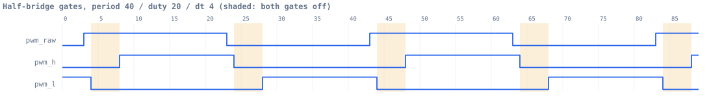
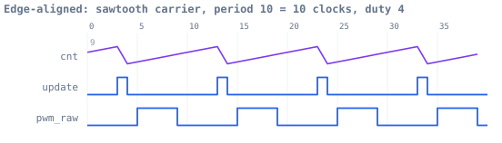
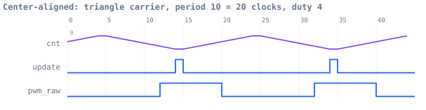
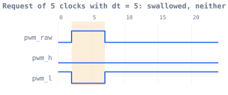
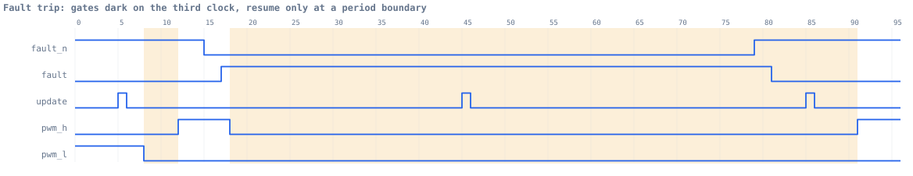
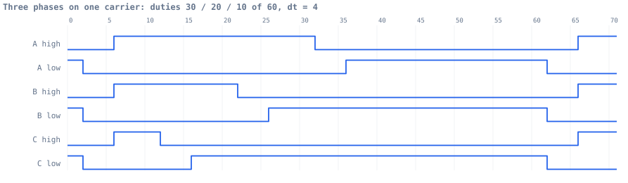

# pwm-deadtime

A PWM timer for a MOSFET half-bridge, in Verilog-2001. Runtime-writable
frequency and duty, glitch-free shadow registers, edge- and center-aligned
carriers, a three-phase variant, and a dead-time FSM that guarantees the high
and low side of a leg are never on at the same time — verified cycle-by-cycle.



Turn-**off** is immediate. Turn-**on** waits `dt` clocks. The shaded bands are
that gap. It exists because the two transistors in a half-bridge sit directly
across the DC bus: if the one turning on gets there before the one turning off
has left, they short the bus through themselves, and neither survives it.

Every figure in this README is rendered from the VCD the testbenches actually
produce. `tools/vcd2svg.py` does the rendering and `make -C sim waves`
regenerates all of them, so nothing here is drawn by hand or taken on trust.

## Status

| module | what it does | lines |
|---|---|---|
| `rtl/deadtime.v` | complementary outputs + dead-time FSM | 61 |
| `rtl/pwm_compare.v` | one channel's comparator | 16 |
| `rtl/pwm_counter.v` | carrier: edge- or center-aligned | 51 |
| `rtl/pwm_regs.v` | register file, shadow buffering | 59 |
| `rtl/pwm_top.v` | single-phase: integration, fault synchroniser | 68 |
| `rtl/pwm3_top.v` | three-phase: one carrier, three legs | 102 |

357 lines of RTL. The testbenches are 1840 lines. That ratio is not an
accident — see [Verification](#verification).

## Quickstart

```bash
brew install icarus-verilog gtkwave
```

```bash
make -C sim
```

Lints the RTL and runs all five testbenches. Each prints `TEST PASSED` or exits
nonzero. Then:

```bash
make -C sim soak
```

runs every randomized test long, over four seeds. `make -C sim wave TB=tb_pwm_top`
opens a VCD in GTKWave; `make -C sim bug` reproduces a bug described below.

## How it works

```
              +----------------+        +--------------+     +-----------+
 wr/addr/data | pwm_regs       | period |              | raw | deadtime  | pwm_h
 ------------>| shadow buffers |------->| pwm_counter  |---->|    FSM    |------->
              |                | duty   | (the carrier)|     |           | pwm_l
              +----------------+ dt     +--------------+     +-----------+------->
                    ^                          |                   ^ dt
                    +-------- update ----------+-------------------+
```

### pwm_counter — the carrier

Two counting modes, same duty ratio, different pulse placement.





Edge-aligned is a sawtooth: `f_pwm = f_clk / period`, pulse pinned to the start
of the period. Center-aligned is a triangle: `f_pwm = f_clk / (2*period)`, pulse
sitting in the middle. Real three-phase drives use center-aligned because it
lowers the harmonic content of the line-to-line voltage.

The detail that makes center-aligned work is that **both turning points are held
for a cycle**, so the sequence is `0,1,..,top-1,top-1,..,1,0` and every count
appears exactly twice. Without the holds the endpoints appear once each, the
high time comes out as `2*duty-1` instead of `2*duty`, and 100% duty becomes
unreachable. Holding them makes every expected value a clean doubling of the
edge-aligned case.

Degenerate values are **defined, not illegal** — a register write can produce
any of them and the counter must not be able to run away:

| written | result |
|---|---|
| `duty = 0` | static low, 0%, no edges at all |
| `duty >= period` | static high, 100%, no edges at all |
| `period = 0` or `1` | period clamps to 1 |
| `period` reduced below current `cnt` | turns around next cycle, no run to 0xFFFF |

### deadtime — the safety interlock

A 4-state FSM with exactly one rule: **nothing turns on except by leaving
`S_DEAD`, and `S_DEAD` always runs its counter to zero.** Normal switching,
fault release and reset release all funnel through it, so every turn-on in the
design is preceded by a full dead time by construction.

```
S_LO_ON : pwm_raw          -> S_DEAD, dt_cnt <= dt
S_HI_ON : !pwm_raw         -> S_DEAD, dt_cnt <= dt
S_DEAD  : dt_cnt <= 1      -> pwm_raw ? S_HI_ON : S_LO_ON
          else                dt_cnt <= dt_cnt - 1
S_FAULT : !force_off       -> S_DEAD, dt_cnt <= dt
any     : force_off        -> S_FAULT          (highest priority)
reset   :                  -> S_DEAD, both outputs low
```

`pwm_h` and `pwm_l` are decoded from `next_state` and **registered**, never
decoded combinationally from `state`. A decode of state bits can glitch while
they settle, and a glitch here is a shoot-through in the real bridge.

Three consequences, all intentional. First, **a request narrower than the dead
time is swallowed entirely** — which is why the achievable duty range shrinks as
dead time grows:



Second, **delivered on-time is `duty - dt` clocks, not `duty`.** Real inverters
compensate for this in software. This one does not. Third, **`dt = 0` still
inserts one clock of dead time**: the floor is 1, not 0, on purpose, because a
safety interlock that can be configured to zero is not a safety interlock.

### pwm_regs — why a shadow register

Writes land in staging registers at any time. The active registers load from
them only when `update` pulses, during the last cycle of a period. So a duty
written in the middle of a pulse can never shorten the pulse already in flight —
the output for the current period is whatever was committed at its start.

| addr | byte | name | bits | buffered? |
|---|---|---|---|---|
| 0 | 0x0 | `PERIOD` | `[15:0]` counter top | shadowed |
| 1 | 0x4 | `DUTY` / `DUTY_A` | `[15:0]` compare | shadowed |
| 2 | 0x8 | `DEADTIME` | `[7:0]` clocks | shadowed |
| 3 | 0xC | `CTRL` | `[0]` en, `[1]` force_off | **immediate** |
| | | | `[2]` center | shadowed |
| 4 | 0x10 | `DUTY_B` | `[15:0]` phase B | shadowed (3-phase) |
| 5 | 0x14 | `DUTY_C` | `[15:0]` phase C | shadowed (3-phase) |

**`CTRL` is split on a principle, not for convenience:** a bit that *shapes* the
waveform is double-buffered, a bit that switches the output *off* is not.
Changing counting mode mid-period would emit one malformed period, so `center`
waits for the boundary. Delaying a stop by up to a period is exactly the wrong
trade, so `en` and `force_off` land immediately. Stop means stop.

**Reset values are the safe end of every range, not zero:** `PERIOD` = max
(slowest switching), `DUTY` = 0 (0% output), `DEADTIME` = max (most conservative
interlock), `en` = 0, `force_off` = 1 (gates held off until software explicitly
releases them). So `CTRL` does not read back as zero after reset. That is
intentional — the safe state of an output-disable bit is asserted.

### pwm_top — the fault path



**A 2-FF synchroniser on the fault input.** `fault_n` is asynchronous. An async
signal driving FSM logic directly can be sampled mid-transition by different
flops in different states, leaving the FSM somewhere illegal. It resets to
*tripped*, so the gates are dark out of reset and stay dark until a healthy
`fault_n` has propagated. In the trace above, the trip costs two clocks through
the synchroniser and the gates go dark on the third.

**Recovery waits for a period boundary.** A trip blanks the gates immediately;
re-arming happens only on the next `update`. Restarting mid-period is not a
shoot-through risk — `deadtime.v` serves a full dead time leaving `S_FAULT`
whatever happens — it would just produce a first pulse of arbitrary width.

**A disabled timer drives nothing.** `en = 0` forces both gates off (coast)
rather than parking the low side on (brake). Braking a motor is a deliberate
act, not what "stopped" should mean. So `en` and `force_off` are genuinely
different controls: `en = 0` stops the counter *and* the outputs, while
`force_off = 1` leaves the counter running and blanks the outputs, so clearing
it resumes in step with the period.

### pwm3_top — three phases, one carrier



Six gates, three `pwm_compare` + `deadtime` channels, **one shared carrier**.
All three legs rise together and fall at different times: same carrier,
different duties.

Sharing the carrier is the point, not an optimisation. It is the *line-to-line*
voltage that matters, and that is the difference of two phase voltages. Give
each phase its own counter and they drift, the difference picks up beat
frequencies, and the motor hears them.

The 120° phase relationship is **not in the hardware** — it is in the three duty
values software writes. The carrier stays common; the modulation is what
differs. One `DEADTIME` and one fault input serve all three legs: a bridge fault
kills the bridge, and dead time is a property of the transistors rather than of
which leg they sit in.

## Verification

357 lines of RTL, 1840 lines of testbench. Plain Verilog has no `assert`, no
constrained-random and no classes, so the checkers are ordinary `always` blocks
that run continuously through every test, and the randomization is an LFSR.

**Continuous checkers** — these run for the whole simulation, in every test:

| | check |
|---|---|
| C1 | `pwm_h` and `pwm_l` are never both high. The headline invariant. |
| C2 | a rise of either output is ≥ `dt` clocks after the *other* one fell |
| C3 | both outputs low whenever reset is asserted |
| P1 | cycles between `update` pulses == `period` — the off-by-one killer |
| P2 | `pwm_raw` high cycles per period == `min(duty, period)` |
| P3 | `cnt` stays inside `0 .. period-1` |
| R1 | active config never changes on a cycle where `update` was low |
| R2 | on every `update`, active config == last value written |
| R3 | `en` / `force_off` track `CTRL` on the very next cycle |
| T1 | `pwm_h` high cycles per period == expected, measured at the gate |
| T2 | `pwm_l` high cycles per period == expected, measured at the gate |
| T3 | cycles between `update` pulses == `period`, end to end |

In the three-phase testbench C1, C2, T1 and T2 run once per leg.

**Directed scenarios**: 214 checks across 65 scenarios — 0%, 100%,
`duty > period`, `period` of 2/1/0, requests exactly `dt` long, 1-cycle
requests, `dt = 0`, `dt` larger than the duty, back-to-back edges, disable
mid-period, `force_off` mid-pulse, fault mid-conduction, fault asserted off the
clock edge, reset mid-conduction, both counting modes, and three legs at 0% /
50% / 100% simultaneously.

The integration testbenches drive the design the way software would — through
the register port, with an asynchronous fault line — and measure the **gate
outputs**, not internal signals. The three-phase one closes by walking the
duties around a sine table 120° apart in center-aligned mode, which is what a
drive's control loop actually does, checking every phase against its own
commanded duty at every step.

**Randomized soak**: `make -C sim soak` runs every randomized test long over
four seeds. Beyond that, the design has been soaked over 50 long runs across ten
seeds and all five testbenches, plus 15 seeds at 4000 random reconfigurations
each on both integration testbenches. All clean.

## The bugs the random tests found

Worth reading if you are going to build one of these. The randomized tests found
four bugs. One was in the RTL. Three were in the checkers — and every one of
those blamed the design for a dead time that was actually correct.

### The RTL bug: a shoot-through on the fault path

The obvious first cut of the dead-time FSM has *two* dead-time states,
`S_DT_LH` and `S_DT_HL`, each returning early if the request is withdrawn
mid-count. That shortcut looks safe, and for normal switching it is — the side
that was already on never turned off, so there is nothing to interlock against.

All 14 directed tests passed. The randomized stress failed at cycle 495:

```
** FAIL  cyc=495  t=4950000 : C2 dead time too short before pwm_l rise
```

The fault-release and reset-release paths reuse the same dead-time state *after
the other side has been conducting*, and there the early return turns a device
on before its complement has stopped — two clocks apart with `dt = 10`.

The fix collapses both dead-time states into one non-abortable `S_DEAD`. It is
one state **smaller** than the version it replaced: the early return was an
optimisation protecting a case that did not need protecting. The broken version
is kept so this is reproducible rather than retold:

```bash
make -C sim bug
```

### The checker bugs: three ways to be one cycle wrong

All three were the testbench modelling the register interface slightly wrong,
and all three surfaced only under long random reconfiguration:

1. The dead-time shadow model committed on `update` directly. But `update` is
   **combinational** in `pwm_counter`, so the value visible at a negedge is what
   registers latch at the *next* posedge — the model ran a full cycle ahead.
2. It also read the newly written value rather than the one the load side sees.
   A write landing on the update edge commits at the *following* boundary, which
   is the anti-tearing property `pwm_regs` is built to provide.
3. C2 recorded the `dt` in force *after* the edge the FSM enters `S_DEAD` on.
   The FSM latches it from *before* that edge, and a shadow load on the same
   edge changes it in between.

The lesson that generalises: a checker that models a synchronous interface has
to model *when* things take effect, not just what they become. Getting that
wrong produces confident, specific, entirely false accusations — and they look
exactly like real bugs.

## Known limitations

Named rather than hidden:

- **Dead time reduces effective duty by `dt` clocks.** No software compensation.
- **Dead-time resolution is one clock cycle.** No fine sub-clock delay line.
- **Multi-register writes are not atomic.** `PERIOD` and `DUTY` commit
  independently, so a write pair that straddles a period boundary can leave one
  period running a mixed config — and if that mix has `duty >= period`, that is
  one period at 100% duty. Workaround: change frequency with the timer stopped.
  Fix: a `LOAD` commit bit that arms the shadow load, which is what the STM32
  timer's UG bit is for. Not built.
- **The fault is not latched.** Clearing `fault_n` re-arms automatically at the
  next period boundary. Real drives usually latch the trip so software must
  acknowledge it, which stops a chattering fault causing repeated restarts.
- **16-bit write port, not AXI4-Lite.** A bus wrapper is a separate job.
- **Simulation only.** No FPGA bring-up, no scope traces, no timing closure
  against a real device. Simulation cannot produce metastability either — the
  synchroniser is there for real silicon, and the testbench only proves the
  logic does not care which part of the cycle a trip arrives in.

## Repo layout

```
pwm-deadtime/
  rtl/    deadtime.v  pwm_compare.v  pwm_counter.v
          pwm_regs.v  pwm_top.v      pwm3_top.v
  tb/     tb_deadtime.v  tb_pwm_counter.v  tb_pwm_regs.v
          tb_pwm_top.v   tb_pwm3_top.v
  sim/    Makefile                  # make / soak / waves / bug / wave / lint
  tools/  vcd2svg.py                # VCD -> SVG, renders every README figure
          vcd2ascii.py              # the same thing as text, for terminals
          make_waves.sh             # regenerates docs/waves/ from the VCDs
  docs/   waves/*.svg
          deadtime_v1_buggy.v       # the broken first FSM, kept on purpose
  PLAN.md
```

`PLAN.md` has the full design notes, the phase plan, and the interface contract
between `pwm_regs` and `pwm_counter`.
